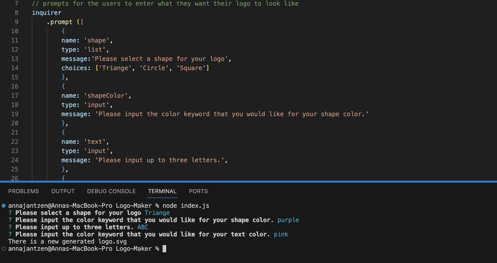
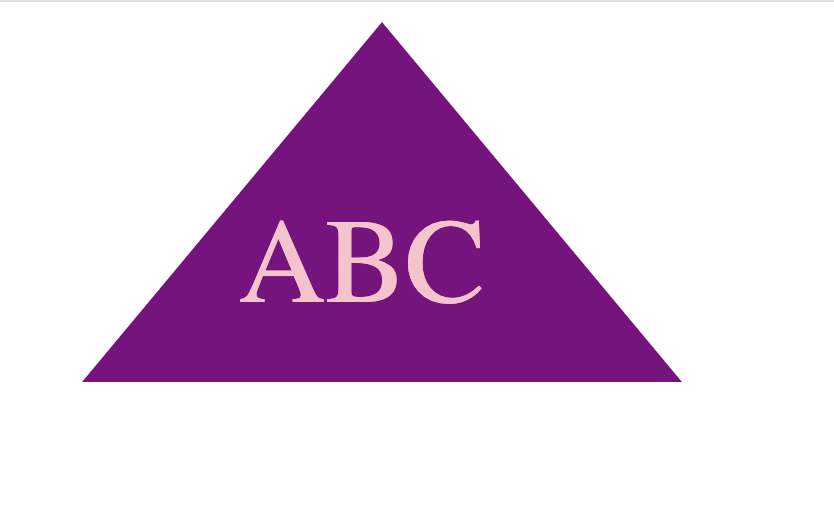
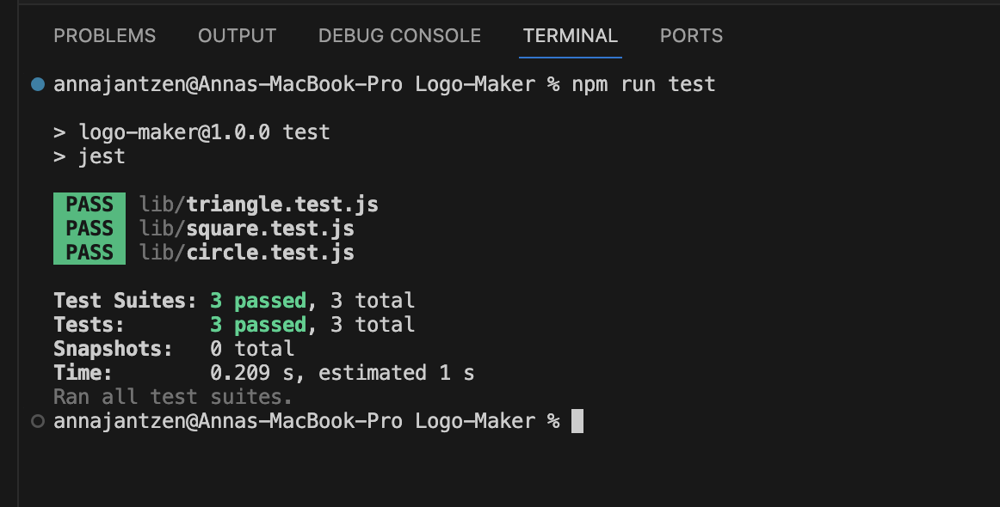

# Logo-Maker 

  ## Description
  The purpose of this application is to genterate simple logos with up to three letters in it. The user can choose their background color, the letter color, and can choose between up to 3 shapes.

  ## Table of Contents
  1. [Installation](#installation)
  2. [Usage](#usage)
  3. [License](#license)
  4. [Contributors](#contributors)
  5. [Tests](#tests)
  6. [Contact](#contact)

  ## Installation
  Inquirer 8.2.4 and Jest

  ## Usage
  This will be used to produce simple logos for an array of different things from individuals to companies.
  
  
  
  

  ## License
  MIT

  ## Contributors
  N/A

  ## Tests
  The application was tested using Jest

  ## Contact
  